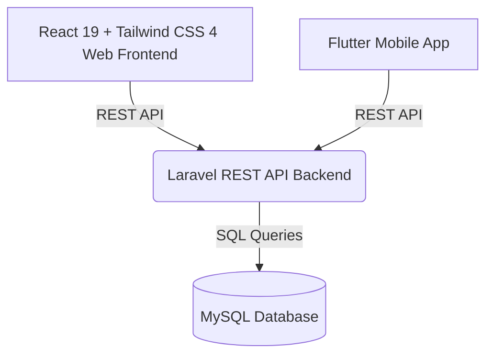

# System Architecture

This document describes the high-level architecture of the Bukhara State Technical University (BSTU) International Website Monorepo.

## Architecture Overview

The system consists of three primary components that interact to provide a seamless multilingual web and mobile experience.

### Components

#### 1. Web Frontend (`apps/web`)

* **Technologies**: React 19, Vite, Tailwind CSS 4, React Router 7, Framer Motion.
* **Role**: Serves the public-facing multilingual website, `/student` portal, and `/apanel` administration UI.
* **Communication**: Performs asynchronous HTTP requests to the Laravel REST API backend to fetch dynamic content, translations, menus, student records, and admin resources.

#### 2. Backend Server & API (`apps/api`)

* **Technologies**: Laravel 13.19.0 (PHP), RESTful APIs.
* **Role**: Serves as the central server controller, processing requests from both web and mobile clients, handling business logic, user authentication, and data operations.
* **Communication**: Exposes `/api/v1` REST API endpoints, uses Laravel Sanctum for token authentication, and connects to the MySQL database.

#### 3. Database (`database-docs` / MySQL)

* **Technologies**: MySQL.
* **Database Name**: `bstu_international`
* **Role**: Persists all system data, including faculty listings, department descriptions, administration records, news, announcements, student applications, uploaded document metadata, contracts, payments, notifications, menus, and translation values.

#### 4. Mobile Application (`apps/mobile`)

* **Technologies**: Flutter.
* **Role**: Provides a native mobile application experience for guests and students.
* **Communication**: Connects to the same Laravel REST API backend.

## Supporting Project Areas

* `docs` — active architecture, API, frontend, backend, apanel, student, and mobile documentation.
* `database-docs` — MySQL schema and content migration notes.
* `storage-docs` — Laravel storage/media URL guidance.
* `scripts` — maintained utilities, including the React-to-seed-JSON import helper.

## Localization And Data Flow

The system supports `en`, `uz`, `ru`, and `ar`. Arabic is rendered right-to-left in both web and mobile clients. Public UI text is loaded from `GET /api/v1/translations?locale=...`, while dynamic models use localized database records and English fallback behavior during seeding where translated values are missing.

The typical data path is:

1. Seed/static JSON or apanel writes content into MySQL.
2. Laravel exposes localized resources through `/api/v1`.
3. React and Flutter fetch the same API and render localized UI.
